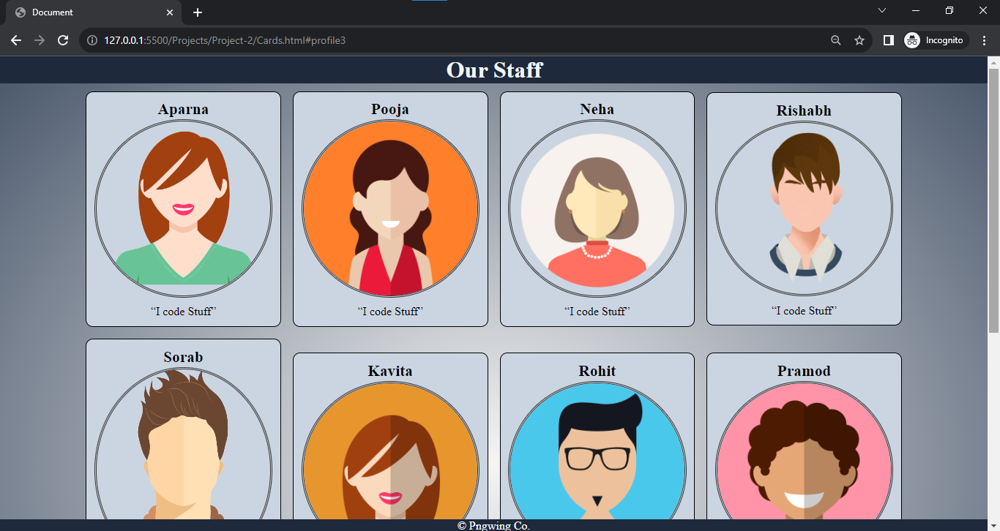

# Responsive Cards Project

This project demonstrates how to create a set of responsive cards using HTML, CSS, and media queries. Responsive design ensures that your content adapts gracefully to different screen sizes, providing a seamless user experience across various devices.

## Demo

Attractive cards design with customizable content.

## Technologies Used

- HTML: Markup structure of the cards.
- CSS: Styling and layout.
- Media Queries: Implement responsive design for different screen sizes.